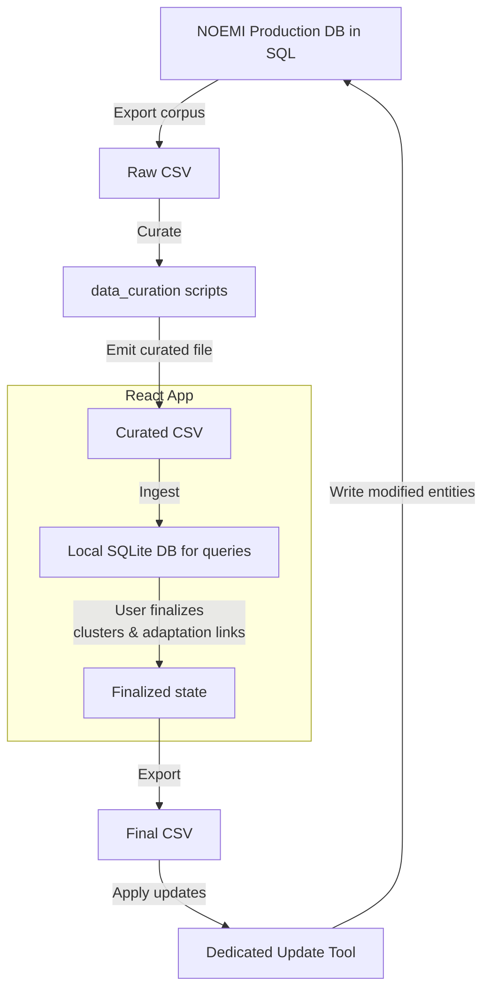
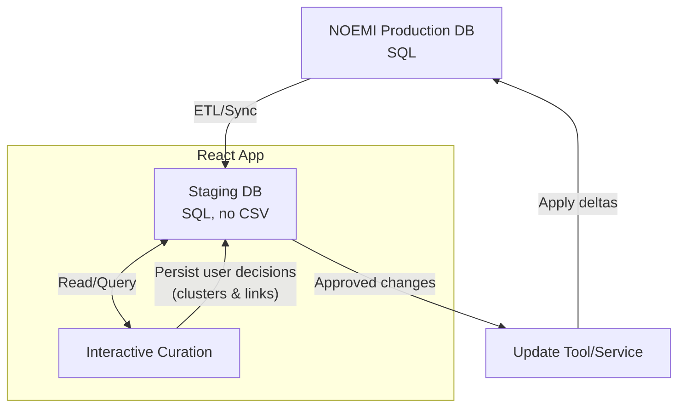

# Vendange
---

_Vérification Experte, Nettoyage et Dédoublonnage des Arbres NOEMI par Grappage Enchâssé_

### Disclaimer
While the ideas behind Vendange's clustering operations and its UI are the result of human reflexion, the code was produced by gpt-5-codex in codex cli.

### Overview
- Python CLI to run modular data-curation operations on Intermarc CSV for IFLA-LRM entities.
- Web UI to review, approve/reject/alter merges and export a curated dataset.

### Getting Started
1) Data sources
- The starting point of our project is a database containing the **French National Library's catalog** in Intermarc Nouvelle Génération (NG), a format that's compatible with IFLA LRM and implements the RDA-FR cataloguing code. Information about the purpose of the migration can be found [here](https://www.rdatoolkit.org/sites/default/files/rsc/BNF_intermarc_Foucher.pdf). This format belongs to the broad family of MARC (*Machine-Readable Cataloging Record*) formats, about which please see this page of the [Library of Congress](https://www.loc.gov/marc/umb/um01to06.html).
  - Cataloging guidelines for Intermarc NG can be found on [Kitcat NG](https://kitcatng-ext.bnf.fr/consignes-catalogage), the BNF's cataloging reference guide for the new format, but the description of Intermarc NG fields is not publicly available yet. Meanwhile, one can rely on [Kitcat](https://kitcat.bnf.fr/manuel-intermarc), the previous reference guide, which contains a detailed description of fields in Intermarc.
- We accessed the database through the current version of NOEMI, an internal website of the National Library that allows its teams to access, modify and augment the catalog. NOEMI is still in a pre-release phase during which migration tests are regularly conducted, from Intermarc to Intermarc NG. It is populated by a temporary version of the database after a mock migration.
- current_export.csv is a **small sample taken from this temporary snapshot**.
  - It comprises all works whose agent (relator fields 700, 701 or 702 for people, 710, 711, or 712 for groups) is the Comtesse de Ségur (technically the ark identifier of her record : ark:/12148/cb130916590), the expressions pointing to those works, and the manifestations pointing to those manifestations.
  - In the SQL query, we also had to retrieve all entities (agents, works, expressions, manifestations, *valeur contrôlée*, *brand*) whose ark identifier appears in any field of the initial matches, to be able to display the record of those initial matches with all values in human-readable format, as at, the time of writing, there is no API access to the new catalog.
  - The list of initial works and the SQL query can be found in folder [sql](documentation/sql_NOEMI).

2) Understanding links between entities
- In addition to the Kitcat pages mentioned above, please see the rough-hewn and schematic "Linked entity ontology" in [AGENTS.md](AGENTS.md)

3) Data curation
- Operation implemented: clustering works and expressions, creating adaptation links between original works and adaptations.
- For each clustered work (besides the anchor), the anchor gets a new `90F` zone with:
  - `90F$a` = ARK of the clustered work (from `001$a`)
  - `90F$q` = `Clusterisation script`
  - `90F$d` = today (YYYY-MM-DD)
- Adaptation links:
  1. The original work gets a `552$q` subfield with the ARK identifier of the controled value with `169$a` "A pour adaptation" and a `552$3` subfield pointing to the ARK identifier of the adaptation.
  2. The adaptation gets a `552$q` with the ARK identifier of the controled value with `169$a` "Est une adaptation de" and a `552$3` subfield pointing to the ARK identifier of the original work.
  
4) Running the script
- To build only the clusters: ```python -m data_curation.cli cluster --input data_inspection/data/current_export.csv --output data_inspection/data/curated.csv --clusters-json data/curated.json```
- To launch the FastAPI server in `data_curation/api`: `uv run fastapi dev app.py`. See below for explanations.

### Debug & Fixtures

- **Interactive variant debugging** — set `TITLE_MATCH_DEBUGGER=1` when running the CLI (typically with `-vv`) to drop into `pdb` right before NLP cleaning. Example: ```TITLE_MATCH_DEBUGGER=1 python3 -m data_curation.cli -vv detect-contamination --input data/in.csv --out-json data/out.json``` lets you inspect the exact strings matched against the title before spaCy processes them.
- **Styled debug logs** — use `-vv` to unlock Rich-powered logs: the CLI renders colourful panels, syntax-highlighted titles, and tables for matched variants and removed segments.

Review in the Web UI
- Start the UI: `npm run dev`
- Click **Load CSVs** to open the modal dropzone, then drop the pair (curated + original) or pick them manually. A file named `curated.csv` replaces the curated dataset; any other `.csv` replaces the original dataset.
- The UI detects clusters by scanning for `90F$q = "Clusterisation script"` in works.
- Key information about entities is displayed in badges:
  - Yellow for children expressions.
  - Green for descendent or children manifestations.
  - Light blue for links in 5XX fields, including adaptation.
  - Deeper blue for agents in 7XX fields.
- Central panel: list of anchors with merged works (checkbox to accept/reject, option to add ARKs).
- Side panel: prettified Intermarc of selected record.
- Click "Export curated CSV" to download a curated dataset based on Original CSV with overridden edited records from Curated CSV.
- UI quality-of-life:
  - Hierarchical selectors show anchors and clustered entries in clearly separated sections with 🍇 for clustered items.
  - Double-click or use user-defined shortcuts on cluster/expression banners to jump between works ⇄ expressions ⇄ manifestations, and the pane auto-scrolls to the linked card.
  - Unchecked expressions automatically move to the independent block; their manifestations are greyed out to signal that they will not change the exported CSV.

Editing anchor or independent entities :
- Click a work anchor, then "Modify record" to open a JSON editor (CodeMirror) for the anchor’s Intermarc.
- Edit existing zones/subzones or add new ones; click "Save" to apply. Changes are reflected in export and cluster view (e.g., title updates).

Exploring W–E–M links
- Click an Expression or Manifestation to view its details in the right panel.
- For Expressions with `90F` fields, the UI displays the anchor/clustered hierarchy similarly to works.

SQL searches
- When the CSV files are loaded, the curated one is turned into a SQLite databse thanks to a FastAPI server located in `data_curation/api`.
- Open a SQL tab to query the database. Use that feature to find for instance all manifestations whose title contains a string that's missing from the title of their ancestor work; the [corresponding query](documentation/sql_vendange/discordant_manifestations_query.md) was generated by `gpt-5-codex` in Codex CLI, running commands against the database to craft the query gradually.

Design Notes
- UI performs all actions client-side; no network dependencies, but reliance on FastAPI for the SQL side of the app.

### Installation

On MacOS Monterey 12.6.7, use Python 3.11 to install spaCy:

```
uv venv --python 3.11
source .venv/bin/activate
uv add numpy==1.26.4
uv pip install pip
uv add spacy
uv run -- spacy download fr_dep_news_trf
```

### Next Steps

============================
#### 🧐 Data curation
============================

1. Finish building the NLP pipeline and ensure the results are accurate in the Comtesse de Ségur dataset:

- [ ] Handle `150$u` properly, to abort clustering or proceed with it depending on the information contained in this subtitle.
- [ ] Handle `150$h` and `150$i` subfields, which contain information about volume segmentation and volume title, to avoid clustering two parts of the same work (see RDA-FR).
- [ ] Untangle clusters created during the first clustering operations, after the initial migration of the catalog to the Intermarc-NG format / RDA-FR cataloging code. See examples in the [relevant issue](https://github.com/julkamny/Vendange/issues/10#issue-3548478837).
- [ ] Clustering aggregative works (fr. *œuvre agrégative*) with individual works (fr. *œuvre simple*), when appropriate. 
- [ ] Clustering combined works (fr. *œuvre mixte*) with purely textual works (*fr. œuvre textuelle*), when appropriate.
- [x] Handle cases where works share the same title and at least one creator, but one has more creators than the other.
- [x] Handle adaptations correctly.
  + Currently, judging by the outcome and by the logs of a clustering w/ adaptation-linking run, it looks like adaptation matching doesn't start from the form of the title after cleansing. E.g. `150 $3 Argeliès Micheline $a Les |Malheurs de Sophie. Adapté par Micheline Argeliès. Images de François Batet $9 B245` and `150 $3 Pitray Paul de $3 Ségur Sophie de $3 Fabrice Delphi $a Paul de Pitray et Delphi Fabrice. Un |bon petit diable $9 B245`. Should be easy to fix.
- [x] Handle abbreviated editions correctly.
- [ ] Look for manifestations that should belong to another work, e.g. `245$g` mentions adaptation, while neither the sibling manifestations nor the ancestor work do.
- [ ] Cluster expressions of a given work when required, e.g. if publishing indications in subfield `014$s` are not relevant, which can only be established upon examining its manifestations.
- [ ] Among manifestations of a given expression, check if number of pages varies widely to detect potential adaptations or abridged versions of the text, what would need to be linked to a different expression and/or work.

2. Move on to other samples of the National Library catalog and tackle other challenges:
  - [ ] Anonymous works.
  - [ ] Cases where the translator is not mentioned, e.g. old translations of the Grimms' tales.
  - [ ] Frequently republished comics properly (e.g. Gosciny & Uderzo, Franquin).
  - [ ] Book series in which the publisher of the translation divides the original volumes differently, e.g. *Le Trône de fer*, *L'Assassin royal*.
  - [ ] School textbooks.

============================
#### 🗃️ Unify data formats by making the entire pipeline database-native
============================

**Current state**: NOEMI stores the source data in an SQL database. We export the corpus to CSV, run data_curation scripts to produce a curated CSV, and the React app ingests that file and converts it into a local SQLite database for querying. After users finalize clustering and adaptation links, the app exports a final CSV, which a dedicated tool uses to update the modified entities in the production NOEMI database.



**Proposed state**: Remove CSV hops and keep everything as a database. The app would read from (and write decisions to) a staging database, and the update tool would apply approved deltas back to NOEMI. This should make queries more efficient during troubleshooting and reduce code devoted to format conversions.

